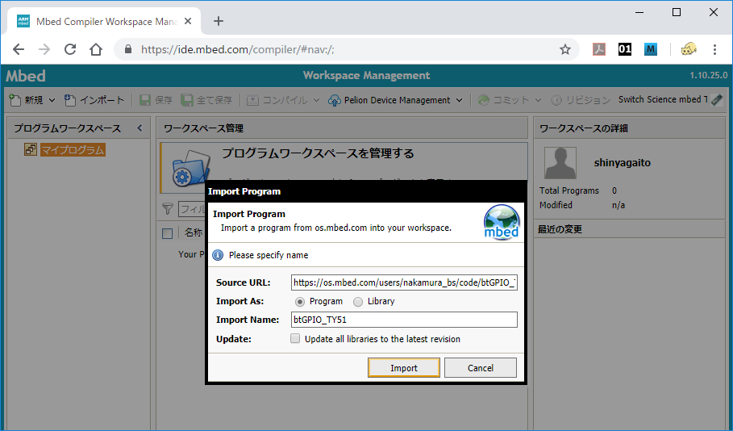

# TY51822r3 の CHIRIMEN BLE IO プログラムをビルドする

CHIRIMEN BLE を利用するには使用する BLE ボード TY51822r3 に専用のプログラムを書き込む必要があります。

TY51822r3 は mbed をサポートしており、PC と USB で接続するとドライブとして認識されます。単にビルド済みのバイナリを書き込むだけであれば、PC と接続した時に認識されたドライブにバイナリファイル (.hex) をコピーするだけで書き込み操作が行われます。

このページでは mbed 環境を使ってプログラムを自分でビルドする場合の手順を説明します。

## 1. アカウントの作成

mbed はブラウザ上で使用できるオンラインの開発環境です。mbed を使用するには mbed のアカウントが必要になります。PC と接続して認識されたドライブ上に HTML ファイルがありますので、これをブラウザで開くと mbed のページに飛ぶ事ができます。


もしまだ mbed のアカウントをお持ちでないならば Sign up を選択してアカウントを登録してください。アカウントにログインした状態で TY51822r3 のドライブ内のリンクからアクセスするとプラットフォームとして TY51822r3 が追加されます。

## 2. プログラムのインポート

CHIRIMEN BLE の TY51822r3 用のプログラムは下のリンクで公開されています。

[btGPIO_TY51](https://os.mbed.com/users/nakamura_bs/code/btGPIO_TY51/)

mbed のアカウントにログインして、このページの右側にある「Import into Compiler」の黄色いボタンを押すと自分のワークスペースにインポートする事ができます。



## 4. プログラムをビルドする

画面上部にある「コンパイル」のボタンを押すとコンパイルが開始され、バイナリファイル ```(btGPIO_TY51.TY51822R3.hex)``` が作成されますので適当な場所に保存してください。このファイルを TY51822r3 のドライブにコピー操作をする事でターゲットへの書き込みが行われます。


