# 1. GPIO 編

# 概要

CHIRIMEN for TY51822r3 を使ったプログラミングを通じて、Web GPIO APIの使い方を学びます。

CHIRIMEN for TY51822r3 を初めて使う方は本チュートリアルを進める前に「[CHIRIMEN for TY51822r3 Hello World](section0.md)」で基本的な操作方法を確認しておいてください。

## CHIRIMEN for TY51822r3 とは

CHIRIMEN for TY51822r3 は PC 等のブラウザと BLE 開発ボード TY51822r3 の組み合わせで動作する IoT プログラミング環境です。

[Web GPIO API](http://browserobo.github.io/WebGPIO/) や、[Web I2C API](http://browserobo.github.io/WebI2C/) といったAPIを活用したプログラミングにより、Web アプリから TY51822r3 に接続した電子パーツを直接制御できます。 

CHIRIMEN for TY51822r3 の開発やこのチュートリアルの執筆・更新は [CHIRIMEN Open Hardware コミュニティ](https://chirimen.org/) によって行われています。

# 1. 準備
## 用意するもの

このチュートリアル全体で必要になるハードウエア・部品は下記の通りです。

* [Hello World 編](section0.md) に記載の「基本ハードウエア」と「Lチカに必要となるパーツ」
* タクトスイッチ (2pin, 4pin を使う場合は向きに注意) x 1
* ジャンパーワイヤー x 適宜
* [Nch MOSFET (2SK4017)](http://akizukidenshi.com/catalog/g/gI-07597/)
* リード抵抗 (1KΩ) x 1
* リード抵抗 (10KΩ) x 1
* [ダイオード (1N4007)](http://akizukidenshi.com/catalog/g/gI-08332/) x 1
* [DC モーター (FA-130RA)](http://akizukidenshi.com/catalog/g/gP-09169/) x 1
  * ブレッドボードで使用しやすいようにケーブルを加工する事が望ましい
  * 回転している事がわかりやすいように軸に模型店等で販売しているプロペラ等を付けておく事が望ましい
* [電池ボックス (単三 2 本用)](http://akizukidenshi.com/catalog/g/gP-00327/) x 1
  * ブレッドボードで使用しやすいようにケーブルを加工する事が望ましい
* 単三電池 x 2

## CHIRIMEN for TY51822r3 の L チカの確認

* [Hello World 編](section0.md) の「3. Lチカをやってみよう」で、L チカが正しく行える所までの動作を確認しておいてください。

## L チカでのおさらい

* CHIRIMEN for TY51822r3 では、各種 example の配線図とコードが [**https://chirimen.org/chirimen-TY51822r3/bc/**](https://chirimen.org/chirimen-TY51822r3/bc/) においてある。

* CHIRIMEN for TY51822r3 で利用可能な GPIO ポートは 0 番から 7 番の 8 つある。

* LED には方向がある。アノードが足が長い方でこちらを GPIO ポートに繋ぐ。反対の足が短い方を GND 側に繋ぐ。抵抗はどちらかに繋ぐ。
* CHIRIMEN for TY51822r3 では Web アプリからの GPIO の制御に [Web GPIO API](http://browserobo.github.io/WebGPIO/) を利用する。

# 2. マウスクリックで LED の ON/OFF を制御してみる

さて、[Hello World 編](section0.md) ではブラウザで LIVE example に直接アクセスして動作を確認していましたが、このパートでは、最初から自分でプログラミングしてみましょう。

ローカルサーバーの環境を既に構築している人、あるいは自分で自由に使えるサーバーをお持ちの人はサーバー上に作成した HTML ファイルを置いてブラウザからアクセスする事で CHIRIMEN for TY51822r3 の Web アプリとして動かせます。

サーバーがない場合は、ローカルの適当なフォルダーに HTML ファイルを作成してブラウザにドラッグアンドドロップする等で、file:// で直接アクセスする事でも動作します (この方法はブラウザのセキュリティ対策強化などの影響により、将来的にも使用できるという保証があるわけではありませんが、現在の所問題なく動作します)。

まず最初の目標はブラウザ上に表示される GUI ボタンの ON/OFF で LED の点灯/消灯をする事です。

## a. 部品と配線について

このパートでは [Hello World 編](section0.md) で実施した L チカの配線をそのまま利用します。必要な部品も同じです。基本ハードウェアと L チカで使った部品を再度確認してください。

基本ハードウェア :  

  

L チカで使った部品 :  

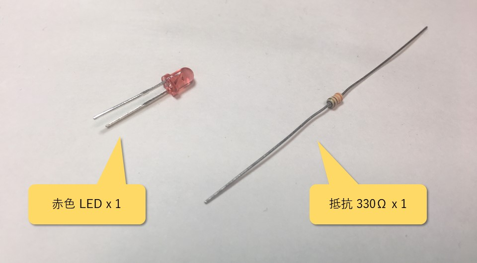

配線は L チカの時と同じです。L チカの LIVE example を開いて表示されるブレッドボードの図を確認してください。  

L チカのターゲットの赤色 LED は、7番、BLE 接続表示用の青色 LED は LED1 のポートに接続します。  

[LEDBlink LIVE example](https://chirimen.org/chirimen-TY51822r3/bc/gpio/LEDblink/)  

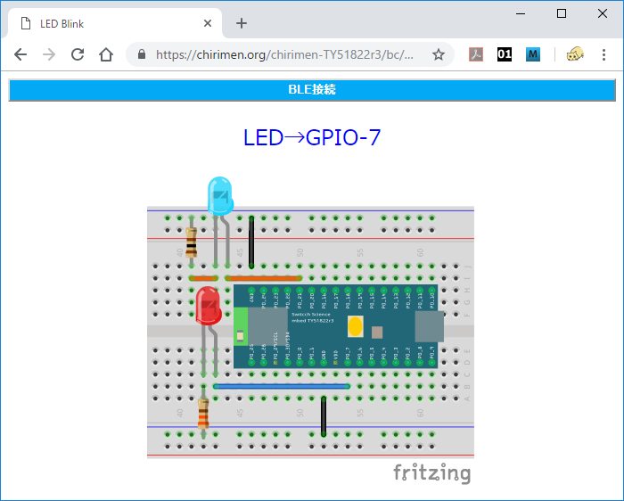

## b. コードの作成

CHIRIMEN for Raspberry Pi 3 のチュートリアルでは [JS Bin](http://jsbin.com/) などのオンラインエディタを使ってテストする例をあげていたのですが、残念ながらこれらのサービスでは CHIRIMEN for TY51822r3 を動作させる際に必要な BLE 接続の選択ダイアログが出せないようです。

テキストエディタで適当なローカルのフォルダーに HTML ファイルを作成して動かしてみましょう。最小限の部分だけ書いて動かします。簡単にするため 1 ファイル (HTML) 内にすべて書いていますが、HTML / JavaScript / css など必要に応じて分けて書いても構いません。

まず、CHIRIMEN for TY51822r3 を動作させるためのポリフィルを読み込みます。CHIRIMEN for TY51822r3 のポリフィル `blePolyfill.js` はこの URL で公開されていますので、ローカルに作成した HTML ファイルでもこれを読み込む事で CHIRIMEN for TY51822r3 のアプリとして動作させる事ができます。

```html
<script src="https://chirimen.org/chirimen-TY51822r3/bc/polyfill/blePolyfill.js"></script>

```

これに続けて HTML の画面上の部品として BLE 接続用と LED ON/OFF 用の 2 つのボタン、そして LED の現在の状態を画面上で表示するためのスタイル指定で丸く成形した ```<div>``` タグを作成します。

```html
<button id="connect">BLE 接続</button><br/><br/>
<button id="onoff">ON/OFF</button><br/><br/>
<div id="led" style="width:60px;height:60px;border-radius:30px;background:#000"></div>
```
次にアプリの本体となる ```<script>``` タグの中身を書いて行きます。

```html
<script>
const DEVICE_UUID = "928a3d40-e8bf-4b2b-b443-66d2569aed50";

async function mainFunction() {
    var bleDevice = await navigator.bluetooth.requestDevice({ filters: [{ services: [DEVICE_UUID] }] });
    var gpioAccess = await navigator.requestGPIOAccess(bleDevice);
    document.getElementById("connect").hidden = true;
    var port = gpioAccess.ports.get(7);
    await port.export("out");
    var onoff = document.getElementById("onoff");
    var led = document.getElementById("led");
    onoff.onmousedown = async ()=>{
        await port.write(1);
        led.style.background="#f00";
    }
    onoff.onmouseup = async ()=>{
        await port.write(0);
        led.style.background="#000";
    }
}
document.getElementById("connect").onclick = mainFunction;
</script>
```

ではこの中身を順を追って説明して行きます。まず最初に

```javascript
const DEVICE_UUID = "928a3d40-e8bf-4b2b-b443-66d2569aed50";
```

が定義されています。これは CHIRIMEN for TY51822r3 の BLE のサービスを表す ID で、CHIRIMEN for TY51822r3 のアプリは常にこの ID を使って周辺の使用可能な BLE デバイスをスキャンする事になります。

そしてその次の `async function mainFunction()` が BLE 接続のボタンを押した時に走る関数になっています。非同期処理のための `async` の指定が付いている事に注意してください。非同期処理については [Hello World編](section0.md) でも出てきましたが、詳しくは [非同期処理 (async await版)](appendix0.md) で解説しています。

さて、`mainFunction()` の中では次のステップで処理を進めます。プログラムの流れに沿って Web GPIO をどのように使っているのかを解説して行きます。

### await navigator.bluetooth.requestDevice()

CHIRIMEN for TY51822r3 では Web GPIO を使い始める前にまず BLE の接続を行う必要があります。この requestDevice() の呼び出しによって接続可能なデバイスの一覧ダイアログが表示され、ユーザーがデバイスの選択を行います。

呼び出しの際には CHIRIMEN for TY51822r3 を動かすための固有のサービスを表す、最初に定義した DEVICE_UUID を指定して、そのサービスを持つものだけをフィルターします。

`requestDevice()` は非同期処理でデバイスのスキャンと選択を行う非同期メソッドですので `await` で完了を待って次の処理を記述します。

async/await を使わず Promise でコードを書きたい場合は返される Promise の `then` にコールバック関数を登録してください。デバイスの選択が完了したら、選択した `bleDevice` パラメータと共に呼び出されます。

### await navigator.requestGPIOAccess()

これは Web GPIO API を利用するための `GPIOAccess` インタフェースを取得する API 呼び出しです。CHIRIMEN for Raspberry Pi 3 でも同様の呼び出しを使用しましたが、CHIRIMEN for TY51822r3 の場合は `navigator.bluetooth.requestDevice()` で取得した `bleDevice` を引数として渡して BLE 接続の相手先を指定する事が必要です。

`requestGPIOAccess()` は非同期処理でインターフェース初期化を行う非同期メソッドですので `await` で完了を待って次の処理を記述します。

async/await を使わず Promise でコードを書きたい場合は返される Promise の `then` にコールバック関数を登録してください。初期化が完了したら `GPIOAccess` パラメータ付きでコールされます。

### gpioAccess.ports.get()

ここで LED が接続されているポートにアクセスするインターフェースを取得しています。

`requestGPIOAccess()` で得た `GPIOAccess` の `GPIOAccess.ports` は利用可能なポートオブジェクトの一覧 ([Map](https://developer.mozilla.org/docs/Web/JavaScript/Reference/Global_Objects/Map)) です。`gpioAccess.ports.get(7)` のように番号を指定することで利用可能なポートオブジェクトの一覧から、 **GPIOポート番号 7** を指定して `port` オブジェクトを取得します。

### await port.export()

`port.export("out")` は、取得したGPIOポートを **「出力モード」** で初期化しています。この初期化処理も非同期処理となっているため、`await` を付けて処理完了を待ってから次の処理に進めます。

このように GPIO ポートにかける電圧を Web アプリで変化させたい時には「出力モード」を指定する必要があります。一方、GPIO ポートはもうひとつ「入力モード」があり、これは GPIO ポートの状態 (電圧の High/Low 状態) を読み取りたい時に利用します。入力モードについてはスイッチを使う例の中で説明します。

この後、画面上の ON/OFF ボタンに対して次のハンドラーを設定しています。
  * onoff ボタンが押されたら `port.write()` で LED のポートに `1` を書き込み、LED 状態表示の `div` の色を赤にする。
  * onoff ボタンが離されたら `port.write()` で LED のポートに `0` を書き込み、LED 状態表示の `div` の色を黒にする。

### await port.write()

ここで使用されている `port.write()` は、出力モードに指定した GPIO ポートの電圧を切り替える指定を行う API です。
`port.write(1)` で、指定したポートから HIGH (TY51822r3 では 3.3V) の電圧がかかり、`port.write(0)` で LOW (0V) になります。
`port.write()` も非同期処理ですので、`await` を付けて処理完了を待ってから次に進みます。

これで画面上のボタンに反応して LED が点灯/消灯するプログラムができました。
実際に動作させると次のようになります。

起動するとボタンが 2 つと LED を表す円が表示されます。  

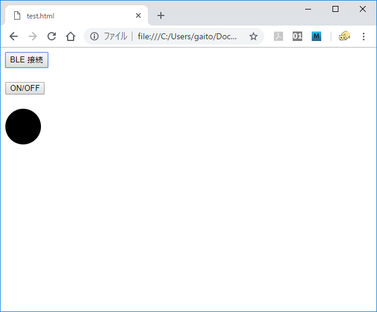  

BLE 接続のボタンを押すと BLE デバイス選択のダイアログが表示されます。 


デバイスを選択して BLE が接続されると、動作を開始します。  
ここで、ブレッドボード側では BLE 接続の青色 LED が点灯します。  

画面の ON/OFF ボタンを押すと押している間だけブレッドボード上の赤 LED が点灯し、画面の LED 表示も赤くなります。  

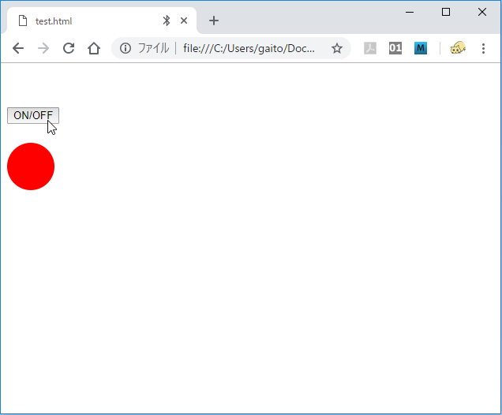

うまく動作したでしょうか?  
このブログラムはサンプルには収録されていませんが、こちらのリンクから試す事ができます。  

[test_click_led.html](examples/test_click_led.html)

# 3. マウスクリックのかわりにタクトスイッチを使ってみる

それでは、さきほどまで書いたコードをベースに、マウスの替わりに電子部品のスイッチを利用してみます。スイッチは GPIO に接続し、**入力モード** で ON または OFF の状態を読み取る事ができます。

今回は一般的に「タクトスイッチ」と呼ばれるものを利用します。色々な種類のものがありますが、ブレッドボード上で使えるものを選んでください。

今回使っているスイッチは一般的に「タクトスイッチ」と呼ばれるもので、押している間だけ端子間が ON になります。

## タクトスイッチについて

「タクトスイッチ」は[アルプス電気の商標](http://www.alps.com/j/trademark/)のようですが、電子部品屋さん等ではアルプス電気製ではないスイッチも、同様の形状のものは「タクトスイッチ」として売られています。
* [秋月電子の「タクトスイッチ」一覧](http://akizukidenshi.com/catalog/c/ctactsw/)

今回の作例ではこのように「電気部品屋さん等でタクトスイッチとして売られてるスイッチ」を使います。

ようするに、下記のような仕様の「タクトスイッチっぽい」スイッチです。

* SPST (1回路1接点)
* プッシュボタン 1 つ
* プッシュボタンの押し込みでスイッチ ON、プッシュボタンを離すとスイッチ OFF (モーメンタリ動作)

注記: 部品の形状としては 1 回路 1 接点ですが端子が 4 つある形のスイッチが一般的です。どの端子間が常に接続されており、どの端子間がボタンによってオンオフされるかを間違えやすいので注意してください。

タクトスイッチの製品ページ などにも回路図がありますが、端子が出ている向き (次の図では縦方向) は常に接続されており、それと直角方向がボタンによって切り替わります。次の図では左の 4pin スイッチと 2pin スイッチ (とジャンパー線) が同じ回路となります。  

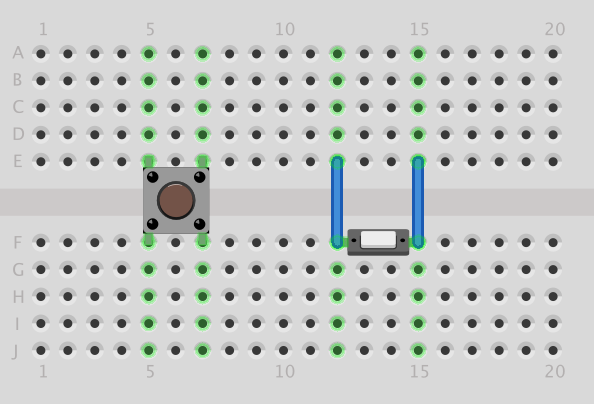

## a. 部品と配線について
今回追加するのは下記部品です。

* タクトスイッチ × 1

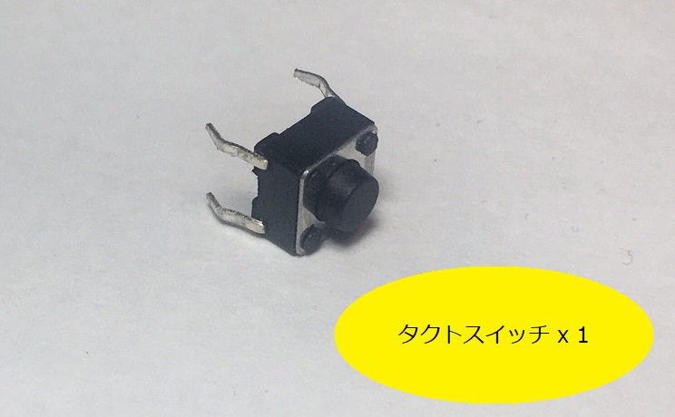

下の図のように、さきほどの LED の配線にタクトスイッチを追加しましょう。

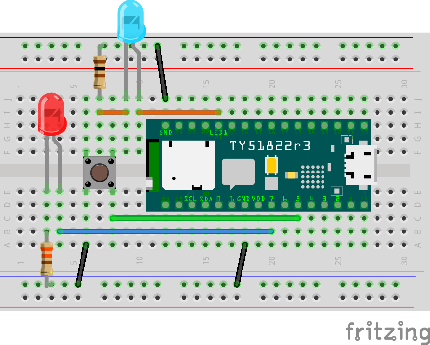

回路図は下の図のようになっています。BLE 接続の状態を表す LED1 端子に接続された 青色 LED、GPIO の 7 番に接続された赤色 LED は L チカの時と同じですが、新たに GPIO の 5 番と GND の間にスイッチが接続されています。

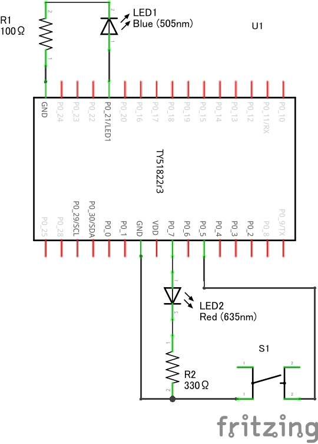

### スイッチの動作と「プルアップ」について

今回の回路では L チカで使用した回路に対して、ポートの 5 番と GND の間にスイッチが 1 つ追加されています。

これでどのようになるかというと、下記のようになります。

* スイッチを押す前は、ポート 5 番は HIGH (3.3V)
* スイッチを押している間、ポート 5 番は LOW (0V)

スイッチを押した時は ポート 5 番は GND に接続されますから 0V になるのはわかると思います。スイッチを押していない時、ポート 5 番はどこにも接続されていない状態になりますが、CHIRIMEN for TY51822r3 では入力モードに設定したポートは自動的に「プルアップ」された状態になり、何も接続しないと「HIGH (3.3V)」になる、という設定になっています。

プルアップとは、回路を **ほどほどの力で** HIGH 側に引っ張っておく事で、初期状態を「HIGH」にすることですが、CHIRIMEN for TY51822r3 では 0 番から 7番までのすべての GPIO ピンは入力モードにするとプルアップされた状態となるように設定されています。

また、これとは逆に何も接続していない場合は「LOW (0V)」になる、という風になっている場合は「プルダウン」と呼びます。

開発ボードの TY51822r3 自体は各 GPIO ピンをそれぞれ「プルアップ」や「プルダウン」に設定する機能を持っていますが、CHIRIMEN for TY51822r3 の環境では 入力モードの GPIO は全てプルアップとなります。

## b. スイッチに反応するようにする (port.read()を使ってみる)

いよいよ、スイッチに対応させてみましょう。

まずは、単純に「GPIOポートの状態を読み込む」 `port.read()` を使ってみたいと思います。`port.read()` で GPIO を読み込むコードは次のように書けます:

先ほどのマウスクリックで LED を付けるコードに追加して、ポート 5 番を入力に設定して読み込みます。

```javascript
  const DEVICE_UUID     = "928a3d40-e8bf-4b2b-b443-66d2569aed50";
  var bleDevice = await navigator.bluetooth.requestDevice(
    {filters:[{ service: [DEVICE_UUID]}]}
  );
  var gpioAccess = await navigator.requestGPIOAccess(bleDevice);
  //
  // ここまでは write と一緒。
  //
  var port = gpioAccess.ports.get(5); // Port 5 を取得
  await port.export("in"); // Port 5 を「入力モード」に。
  var val = await port.read(); // Port 5の状態を読み込む
```

書き込みの場合と異なるのは次の 2 点です。

### await port.export()

`port.export("in")` により取得した GPIOポートを「入力モード」で初期化しています。非同期処理の待機が必要です。

GPIO ポートにかかる電圧を Web アプリ側から読み取りたい時に使います。

### await port.read()

`port.export("in")` で入力モードに設定した GPIO ポートのデータを任意のタイミングで読み取ります。読み取りは非同期処理になるので `await` で完了を待つようにしてください。

Promise でコードを書きたい場合は `port.read().then((data)=>{ ... });` のように書きます。

上記コードで GPIO ポートの読み取りが１度だけ行えますが、今回は「スイッチが押された状態を監視する」ため、定期的に `port.read()` を行って GPIO ポートを繰り返し読み取る必要があります。このようなプログラムの繰り返しにより状態を監視する仕組みは「ポーリング」と呼ばれます。

`port.read()` で値を読み取る処理を繰り返して、1 回毎に一定の待ち時間を入れる事でスイッチの状態を監視し、それに合わせた動作を行うプログラムを書く事ができます。

ただし、CHIRIMEN for TY51822r3 でのポートの状態を読み取る動作は、間に BLE 通信を経由していますので、CHIRIMEN for Raspberry Pi 3 と比較しても低速なものです。下のコードでは 1 秒に 1 回程度の頻度でポートを監視(ポーリング)し、現在の状態に合わせた処理を行っています。

```javascript
const DEVICE_UUID = "928a3d40-e8bf-4b2b-b443-66d2569aed50";
var bleDevice = await navigator.bluetooth.requestDevice(
  {filters:[{ service: [DEVICE_UUID]}]});
var gpioAccess = await navigator.requestGPIOAccess(bleDevice); // writeと一緒。
var port = gpioAccess.ports.get(5); // Port 5 を取得
await port.export("in"); // Port 5 を「入力モード」に。
while(1) {
  var val = await port.read(); // Port 5 の状態を読み込む  
  //
  // ここにswitchの状態による処理を書き足す
  //
  await sleep(1000); // 1 秒待ってから繰り返す
}
```

LED の処理と組み合わせて HTML 全体のコードは下記のようになります:

```html
<!doctype html>
<html><body>
<script src="https://chirimen.org/chirimen-TY51822r3/bc/polyfill/blePolyfill.js"></script>

<button id="connect">BLE 接続</button><br/><br/>
<div id="ledView" style="width:60px;height:60px;border-radius:30px;background:#000"></div>

<script>
async function mainFunction() {
  const DEVICE_UUID = "928a3d40-e8bf-4b2b-b443-66d2569aed50";
  var bleDevice = await navigator.bluetooth.requestDevice({ filters: [{ services: [DEVICE_UUID] }] });
  var gpioAccess = await navigator.requestGPIOAccess(bleDevice);

  document.getElementById("connect").hidden = true;
  var ledView = document.getElementById("ledView");

  var ledPort = gpioAccess.ports.get(7); // LED のポート番号
  await ledPort.export("out");
  var switchPort = gpioAccess.ports.get(5); // タクトスイッチのポート番号
  await switchPort.export("in");

  while(1) {
    var val = await switchPort.read(); // Port 5の状態を読み込む
    val = val === 0 ? 1 : 0; // スイッチは Pull-up なので OFF で 1、LED は OFF で 0 なので反転させる
    
    await ledPort.write(val);
    ledView.style.backgroundColor = val ? "red" : "black";
    await sleep(1000);
  }
};
document.getElementById("connect").onclick = mainFunction;
</script>
</body></html>
```

さて、出来たらスイッチを押してみてください。
LED が押してる間だけ点灯したら成功です。

ただし一応動作はするのですが、1 秒に 1 回しかボタンの状態を監視していないので、最悪ボタンを 1 秒ほど押し続けないと反応しない場合がありますね。監視のループを回す速度をもっと上げれば改善するのですが、先ほども言ったようにこの速度はあまり上げる事ができません。

こちらのリンクからこのサンプルのコードを試す事ができます : 
[test_switch_poll.html](examples/test_switch_poll.html)

ポートの状態を読み込む目的によっては、このような構造で充分な場合もありますが、次のサンプルでは別のアプローチでスイッチの状態に反応するコードを書いてみます。

## c. スイッチに反応するようにする (port.onchange())

これまで一通り `port.read()` を使ったスイッチの制御方法を見てきましたが、実は Web GPIO API には「入力モード」の GPIO ポートの状態を取得する方法がもうひとつ用意されています。それが `port.onchange()` です。

`port.onchange()` の説明は後回しにして、さきほどのサンプルを `port.onchange()` を使ったコードに書き換えてみましょう。

```html
<!doctype>
<html><body>
<script src="https://chirimen.org/chirimen-TY51822r3/bc/polyfill/blePolyfill.js"></script>

<button id="connect">BLE 接続</button><br/><br/>
<div id="ledView" style="width:60px;height:60px;border-radius:30px;background:#000"></div>

<script>
async function mainFunction() {
  const DEVICE_UUID = "928a3d40-e8bf-4b2b-b443-66d2569aed50";
  var bleDevice = await navigator.bluetooth.requestDevice({ filters: [{ services: [DEVICE_UUID] }] });
  var gpioAccess = await navigator.requestGPIOAccess(bleDevice);

  document.getElementById("connect").hidden = true;
  var ledView = document.getElementById("ledView");

  var ledPort = gpioAccess.ports.get(7); // LED のポート番号
  await ledPort.export("out");
  var switchPort = gpioAccess.ports.get(5); // タクトスイッチのポート番号
  await switchPort.export("in");

  // Port 5 の状態が変わったタイミングで処理する
  switchPort.onchange = async function toggleLed(val) {
    val = val === 0 ? 1 : 0; // スイッチは Pull-up なので OFF で 1、LED は OFF で 0 なので反転させる
    await ledPort.write(val);
    ledView.style.backgroundColor = val ? "red" : "black";
  };
};
document.getElementById("connect").onclick = mainFunction;
</script>
</body></html>
```

コードを見ていただけたらお気づきかもしれませんが、`port.onchange()` は入力モードの GPIO ポートの「状態変化時に呼び出される関数を設定する」ための機能です。

BLE の通信を経由している事には変わりませんが、1 秒に 1 回のポーリングではなく、ポートの状態が変わった事に対して反応するので速度は改善されたと思います。

それに `port.read()` を使ったコードと異なりポーリングする処理が不要になったので、今回のケースでは簡潔に書けるようになりましたね。

こちらのリンクからこのサンプルのコードを試す事ができます : 
[test_switch_onchange.html](examples/test_switch_onchange.html)

# 4. LED のかわりにモーターを回してみる

Web GPIO API の機能が一通り確認できましたので、最後に違う部品も制御してみましょう。

## モーターについて

ここでは LED を点灯させる代わりにモーターを回してみます。

今回使用するモーターは模型などで使われているごく一般的なもので、乾電池 1 ～ 2 本 (1.5V ～ 3.0V) 程度の電源を繋ぐと回転します。

[秋月電子 DC モーター FA-130RA-2270L](http://akizukidenshi.com/catalog/g/gP-09169/)

ただし、今までの LED をそのままモーターに置き換えれば良いというわけにはいきません。L チカの例の時にも触れましたが、CHIRIMEN for TY51822r3 の GPIO が流せる電流は最大で 5mA です。これに対して今回使用するモーターを回すには正常に回転している状態で数百 mA の電流が必要で、静止状態から回り始める際や回転に負荷がかかっている状態ではさらに大きな電流が必要になります。

そこで、モーターの電源は別途電池から供給して、それを GPIO から **MOSFET** という部品をスイッチとして使って ON/OFF の切り替えを行います。

## MOSFET とは

MOSFET は[電界効果トランジスタ (FET)](https://ja.wikipedia.org/wiki/%E9%9B%BB%E7%95%8C%E5%8A%B9%E6%9E%9C%E3%83%88%E3%83%A9%E3%83%B3%E3%82%B8%E3%82%B9%E3%82%BF) の一種で、主にスイッチング素子として利用される部品です。今回使用するモーターだけではなく、リレーやソレノイド等の大きな電流が必要な部品も GPIO の出力から MOSFET を使ったスイッチング回路を利用して動かす事が可能です。

[MOSFET(Wikipedia)](https://ja.wikipedia.org/wiki/MOSFET)

今回は、Nch MOSFET「[2SK4017](http://akizukidenshi.com/catalog/g/gI-07597/)」を利用します。


## ワイヤーの加工

今回利用するモーターとモーターの電源にする電池用の電池ボックスからワイヤーが出ていますが、ブレッドボードでは少し使いにくいようです。現物の状態によりますが、必要に応じてしっかりしたピンを半田付けする等の対策を行ってください。

オスピンのジャンパー線を切ってモーターや電池ボックスに半田付けすればブレッドボードで扱いやすくなります。接続を間違えやすくなるのでできるだけ元のワイヤーと同じ色を使ってください。

## a. 部品と配線について

DC モーターを動かすために追加する部品は以下の通りです。
モーターのワイヤーはブレッドボード用のジャンパーを切って直接半田付けしています。

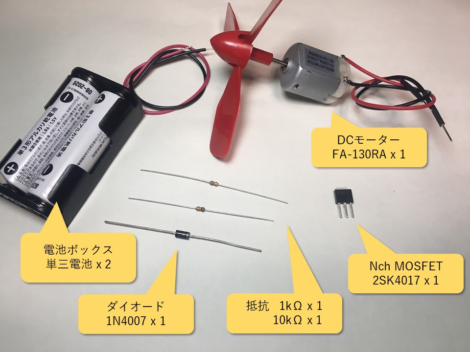

配線は次の図のようになります。LED の代わりに MOSFET 等の部品が並び、モーターが接続されています。部品数が多くなってきましたので、注意して配線しましょう。

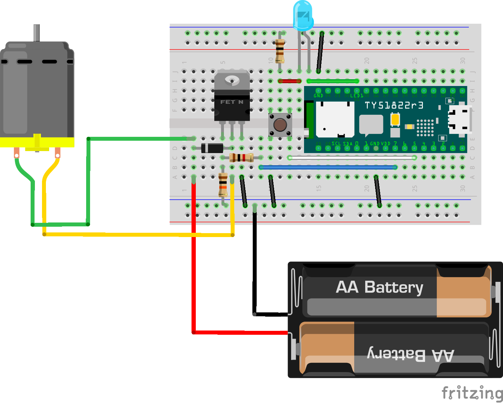

回路としては次の図のようになっています。  
LED1 に接続されている青色 LED と 5 番ポートに接続されているスイッチは今までと同じです。

前回 LED が繋がっていた 7 番ポートは抵抗を通して MOSFET のゲートに接続されています。  
そして MOSFET の D - S 間をスイッチとして使って電池でモーターを接続する、という手順です。

モーターと並列に接続されているダイオードは回路の保護用です。これが無いとスイッチの ON/OFF に伴って発生する逆起電力と呼ばれる現象によって稀に半導体部品が壊れる場合があります。

モーターだけでなく、リレーやソレノイド等、内部にコイルの性質を持つ部品を接続する場合はこのような現象が起こりますので注意が必要です。

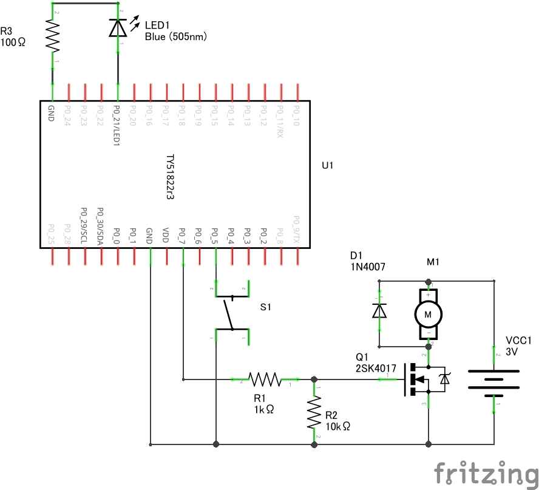


## b. 動かしてみる

さて、これで LED が点灯する代わりにモーターが回るようになりました。  
試してみましょう。

[](imgs/section1/dcmotor.mp4)

うまくいったでしょうか?  

# まとめ

このチュートリアルでは、実際にコードを書きながら CHIRIMEN for TY51822r3 での Web GPIO API の基本的な利用方法を学びました。

* Web GPIO API を使った GPIO 出力ポートの設定と出力処理までの流れ  (`navigator.requestGPIOAccess(bleDevice)`〜`port.write()`）
* Web GPIO API を使った GPIO 入力ポートの設定と読み出し処理の流れ  (`navigator.requestGPIOAccess(bleDevice)`〜`port.read()`）
* Web GPIO API を使った GPIO 入力ポートの設定と変化検知受信の流れ  (`navigator.requestGPIOAccess(bleDevice)`〜`port.onchange()`)

このチュートリアルで書いたコードは以下のページで参照できます:

* [GitHub リポジトリで参照](https://github.com/chirimen-oh/tutorials-TY51822r3/tree/master/ble/ja/examples)

* ブラウザで開くページ (各ステップ)
  * [マウスで画面のボタンを押している間だけ LED が光る](https://chirimen.org/tutorials-TY51822r3/ble/ja/examples/test_click_led.html)
  * [タクトスイッチを押している間だけ LED が光る (ポーリング)](https://chirimen.org/tutorials-TY51822r3/ble/ja/examples/test_switch_poll.html)
  * [タクトスイッチを押している間だけ LED が光る (onchange)](https://chirimen.org/tutorials-TY51822r3/ble/ja/examples/test_switch_onchange.html)

次の『[チュートリアル 2. I2C 編]』では Web I2C API の学習をします。
